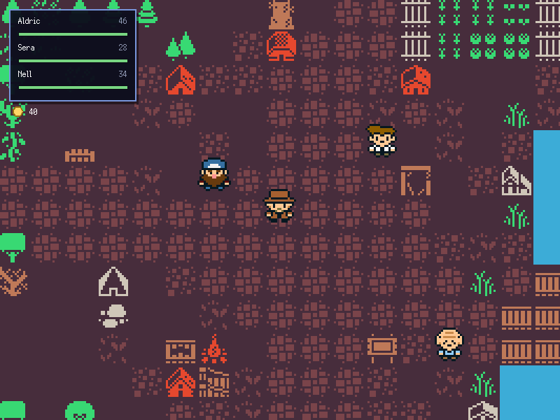
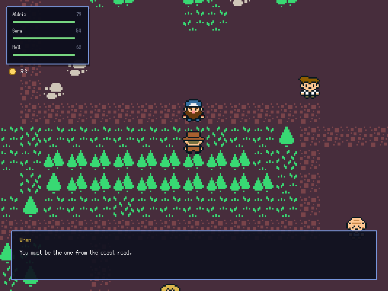
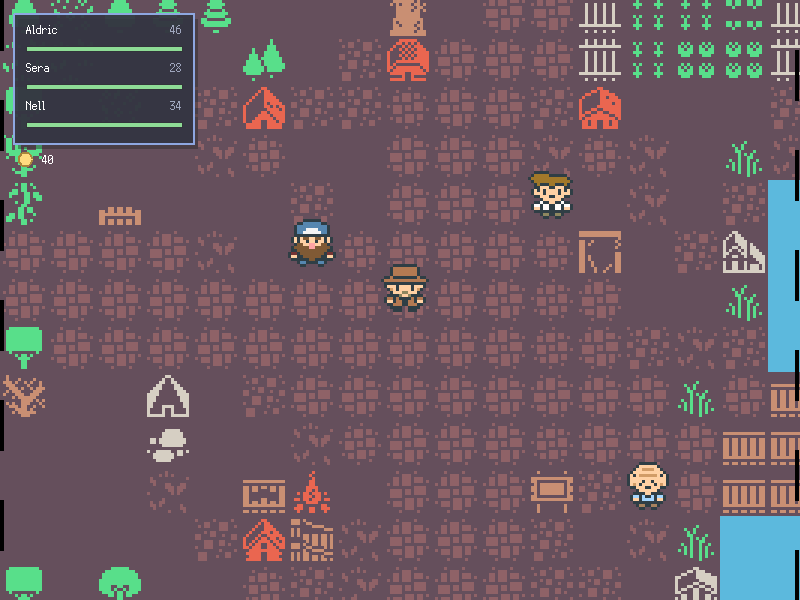
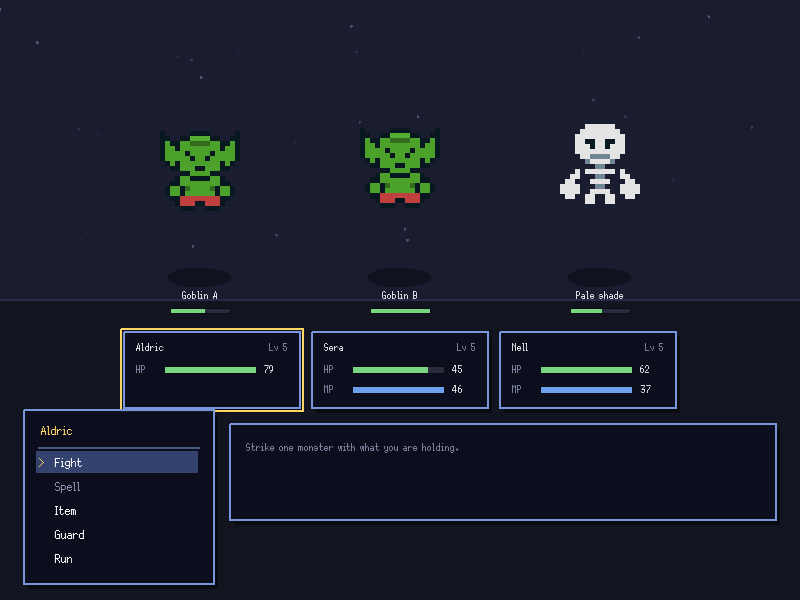
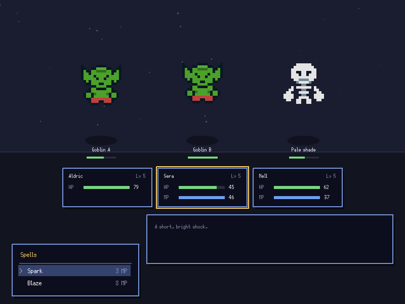
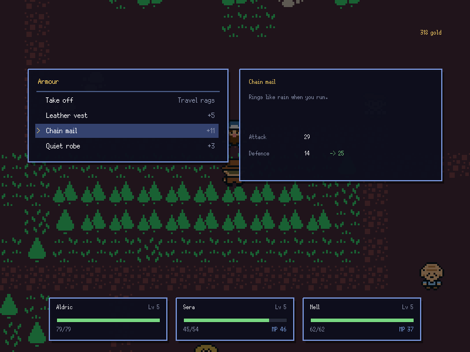
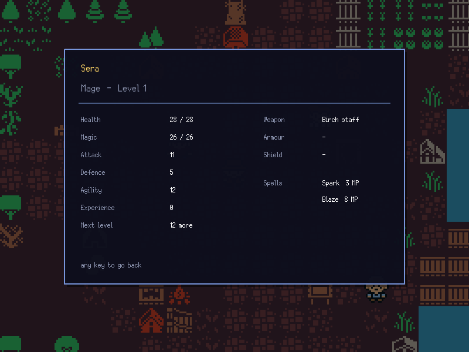

# Top-down RPG

A complete small RPG, written in Ghost with nothing but Lumen's modules: a world
to walk, people to talk to, random encounters, turn-based battles, levelling,
equipment, an inventory, and saving.

```bash
lumen examples/60_rpg
```

| | |
| --- | --- |
|  |  |
| The village square, with the party's health in the corner and a marker over whoever is in reach. | Typewriter dialogue that wraps to the box and pages on a keypress. |
|  |  |
| An encounter flashes, shakes, and closes bars over the world before the fight is built behind them. | Front-view turn-based combat. The active hero is picked out, and the panel explains whatever the cursor is on. |
|  |  |
| Spells list their cost and grey out when there is not enough magic to cast them. | Equipment shows what a piece would do to that hero's numbers before it is equipped. |
|  | |
| The full sheet: stats, gear, spells, and what the next level costs. | |

| | |
| --- | --- |
| move | arrow keys / WASD / gamepad stick or d-pad |
| confirm | space or E (gamepad A) |
| cancel | escape or Q (gamepad B) |
| menu | tab (gamepad start) |
| save / load | F5 / F9 |
| debug | F1 |
| mute | M |
| fullscreen | F11 |
| quit | escape, with nothing else open |

## What each file shows

| File | |
| --- | --- |
| `main.ghost` | game state, callbacks, encounters, transitions, interaction, saving, depth sorting |
| `data.ghost` | every item, spell, monster, and hero in one table |
| `combatant.ghost` | shared stats for heroes and monsters, damage, levelling |
| `party.ghost` | the party, the purse, the pack, and equipping |
| `battle.ghost` | the turn-based battle state machine and combat arithmetic |
| `battleview.ghost` | drawing a battle, with no rules in it |
| `ui.ghost` | the panel, bar, and scrolling menu every screen is built from |
| `fieldmenu.ghost` | pack, equipment, status sheets, resting, saving |
| `tilemap.ghost` | loading a Tiled JSON map, per-layer collision, bridges, culling |
| `camera.ghost` | smoothed following, map bounds, zoom, screen shake |
| `player.ghost` | dt-scaled movement, axis-separated collision, walk cycles |
| `npc.ghost` | characters that talk and hand over items |
| `dialogue.ghost` | typewriter text, wrapping, paging |
| `hud.ghost` | party health and gold while walking |
| `sounds.ghost` | a small sound bank |

## The window

The game is laid out for an 800x600 canvas and never asks how big the window
actually is:

```js
window.setLogicalSize(canvasWidth, canvasHeight)
window.setMode(startingWidth(), startingHeight())
```

Lumen scales that canvas to fill the window, keeps its proportions, and centres
what is left over behind black bars. Fullscreen therefore makes everything
bigger — the text, the tiles, the panels — rather than showing more of the map
around the same small interface. Everything the game draws, including where the
mouse is, is in canvas coordinates, so no layout code has to know any of this is
happening.

The window opens at the largest whole multiple of the canvas the display has
room for, which is where most of the readability comes from: on a 1080p screen
the game starts at 1200x900 and the 24-pixel body font is drawn at 36.

## The battle

Front-view and turn-based, in the Dragon Quest mould. Each round every hero is
given an order, the monsters decide theirs, and then everyone acts in order of
agility — so a fast monster can strike before a hero who chose first.

Orders are **Fight**, **Spell**, **Item**, **Guard**, and **Run**. Guarding
doubles defence for the round. Running is likelier the faster the party is
relative to the monsters, and a failed attempt costs the turn.

Damage is `attack - defence/2`, multiplied by a roll between 0.85 and 1.15, with
a one-in-twenty-five chance of a critical hit that ignores armour. Spells ignore
most armour, which is what makes a mage worth bringing against something in
chain mail. Winning splits experience across the survivors and levels them up
along their own aptitudes: the knight keeps gaining health, the mage magic.

Losing costs half the purse and sends the party back where they started. It is
never a lost save.

Encounters are rolled from a weighted table gated on party level, so a level-one
party meets cutpurses and never an ogre.

A fight never simply appears. `beginTransition()` in `main.ghost` freezes the
field, flashes the screen three times, knocks the camera, and closes black bars
in from alternating sides; the battle is built behind the closed bars and fades
up out of them, and the same bars open again on the way back. Two things are
worth copying from it. The bars alternate direction, which reads as a shutter
rather than a curtain. And the field carries on being drawn underneath the wipe,
so the transition is a thing painted over the world rather than a screen of its
own — which is what lets the same twenty lines run both ways.

## The menus

Tab opens the pack, equipment, status sheets, rest, and save. Equipment has
three slots per hero, and the item list shows what each piece would do to that
hero's attack and defence **before** it is equipped, which is the question the
player is actually asking. Taking something off puts it back in the pack.

Everything is built from one `Menu` in `ui.ghost`: rows with a cursor, disabled
entries that grey out and are skipped, a detail panel alongside, and scrolling
once a list outgrows its panel.

## Things worth copying

**Everything moves in pixels per second.** `update(dt)` gets the length of the
previous frame, and speeds are multiplied by it, so the game plays the same on
any machine.

**The tilemap only draws what the camera can see.** The map is 50x50 tiles
across nine layers — 22,500 tiles. `camera.visibleTiles()` narrows that to the
few hundred actually on screen.

**Collision is per layer, and one layer takes it back.** Water, woodland,
fences and buildings are solid; the road layer is passed as an *open* layer,
which clears collision wherever it has a tile. That is the whole of the bridge:
plank tiles drawn on the road layer over the river.

**Collision is resolved one axis at a time.** Moving x and y separately is what
lets a player pressing diagonally into a wall slide along it rather than stick.

**Characters are depth-sorted by y.** Someone standing lower on the screen is
drawn last, so they overlap whoever is behind them.

**The camera is pushed and popped.** The world is drawn inside
`camera.attach()` / `camera.detach()`; the HUD, dialogue, and menus are drawn
outside, in screen coordinates, unaffected by zoom.

**The battle rules never touch the canvas.** `battle.ghost` decides what
happens; `battleview.ghost` draws it. Combat can be reasoned about, and changed,
without a window open.

**Everything the player reads goes through a message queue.** A battle sits on
each line until it is dismissed or times out, so a whole round never resolves
inside one frame with nothing to show for it.

**Saves go to the save directory.** `filesystem` writes to the player's data
directory, not next to the game, and `filesystem.read()` returns `null` when
there is no save yet. Only what cannot be derived is written: levels, current
health, the pack, and what each hero is wearing.

## Shipping it

```bash
lumen build examples/60_rpg -o rpg            # a standalone executable
lumen package examples/60_rpg -o rpg.lumen    # one file, run with `lumen rpg.lumen`
```

`build` writes a copy of the engine with the game appended to it, so what comes
out is a normal program the player double-clicks. It builds for the machine it
is run on.

## The map

`resources/map.json` is a Tiled map, and it is meant to be worth walking
around: a village in a paved square, a pine forest and a broadleaf grove west of
it, a lake with two islands, a river running south under a plank bridge, a
tilled farm, a ruined shrine with a gate you can walk through, and dry
scrubland with cacti in the south-east. Roads join them, and the signposts stand
at the forks.

## Assets

`tilesheet.png` and `characters.png` come from the `53_top_down` example. The
`.wav` effects are synthesised square waves, filtered noise, and sine
arpeggios — placeholders, and small enough to keep in the repository.
